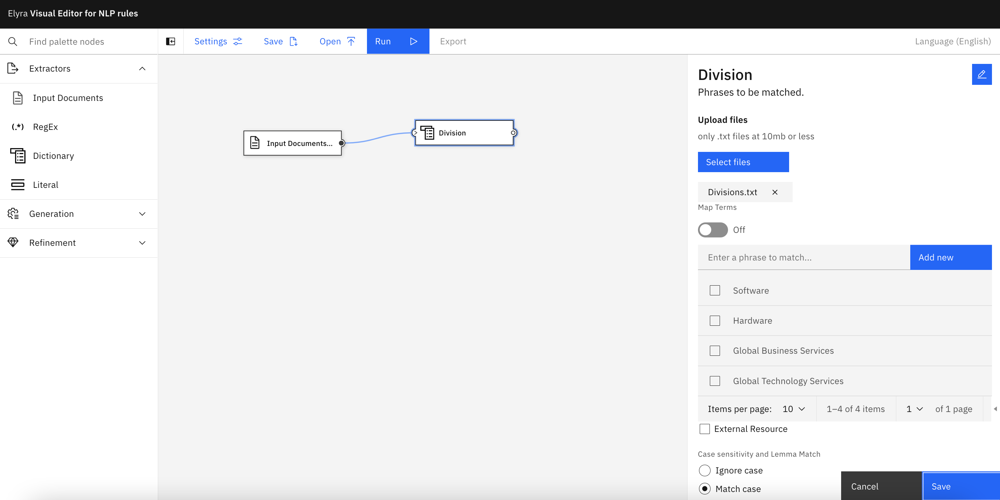
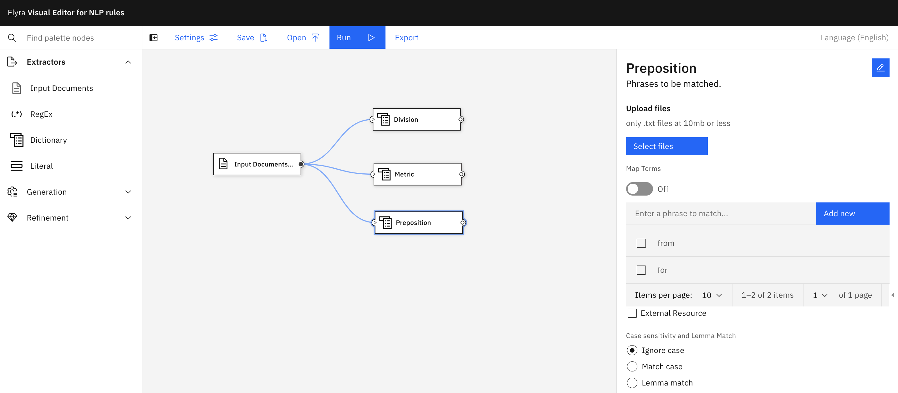
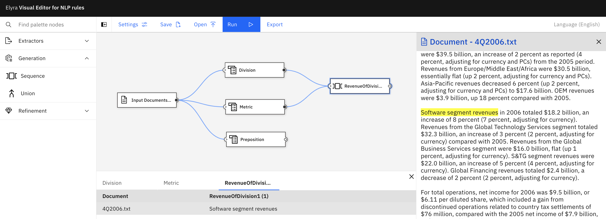
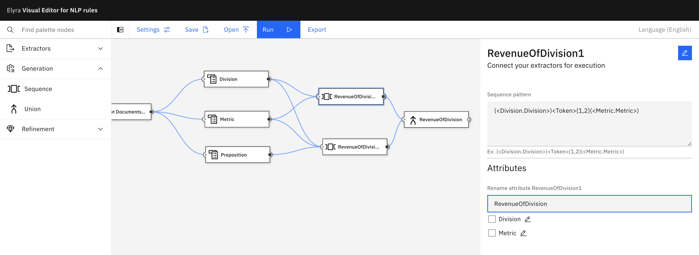
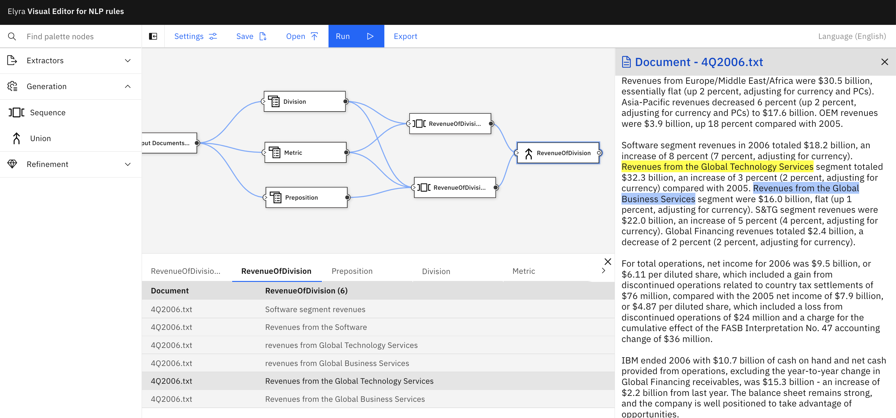
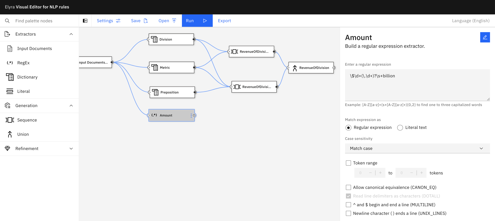
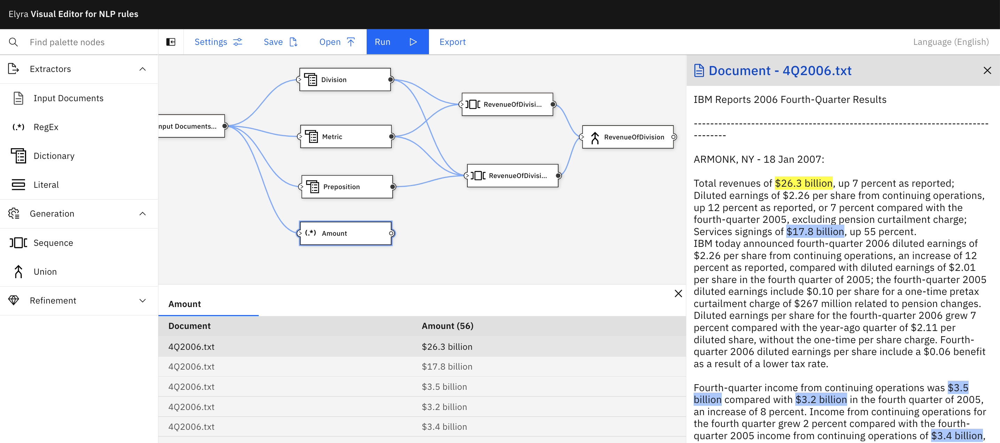
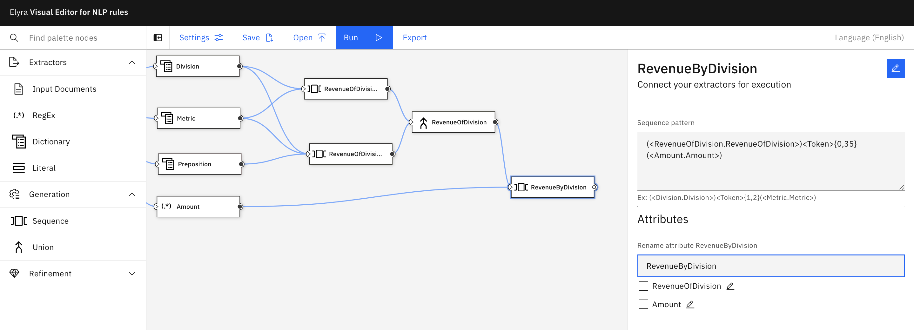

<!--

Copyright 2022 Elyra Authors

Licensed under the Apache License, Version 2.0 (the "License");
you may not use this file except in compliance with the License.
You may obtain a copy of the License at

http://www.apache.org/licenses/LICENSE-2.0

Unless required by applicable law or agreed to in writing, software
distributed under the License is distributed on an "AS IS" BASIS,
WITHOUT WARRANTIES OR CONDITIONS OF ANY KIND, either express or implied.
See the License for the specific language governing permissions and
limitations under the License.
-->
# Tutorial

This tutorial explains the basic concepts in the NLP editor.
The flow created in this tutorial can be imported from [sample-flows/tutorial-flow.json](./sample-flows/tutorial-flow.json) 
and can be executed by uploading the text file [4Q2006.txt](./sample-data/revenue by division/financial statements/4Q2006.txt) into the **Input Document** .

## Set up the input document

Under **Extractors**, drag and drop **Input Documents** on the canvas. Configure with document [4Q2006.txt](./sample-data/revenue%20by%20division/financialStatements/4Q2006.txt). Click **Upload**, then **Close**.

## Create a dictionary of division names 

Under **Extractors**, drag **Dictionary** on the canvas. Connect its input to the output of **Input Documents**. 
Rename the node to `Division` and enter the terms: `Software`, `Hardware`, `Global Business Services`, and `Global Technology Services`. Click **Save**.

## Run the dictionary and see results highlighted

Select the `Division` node, and click **Run**.

## Create a second dictionary of metric names

Similar to the prior step, create a dictionary called `Metric` with a single term `revenue`. Select **Lemma Match**. Don't forget to click **Save**.

## Create a third dictionary of prepositions

Create a dictionary `Preposition` with terms `for`, and `from`. Select **Ignore case**. Click **Save**.

## Create a sequence for "division revenue"

Create a sequence that identifies text such as _"Software revenues"_. Under **Generation**, drag and drop **Sequence** to the canvas. Connect its input with the outputs of nodes `Division` and `Metric`. 
Open the sequence, rename it to `RevenueOfDivision1` and write `(<Division.Division>)<Token>{0,2}(<Metric.Metric>)` under **Sequence Pattern**. Click **Save**. Run the sequence to see results.

## Create a sequence for "revenue from a division"

1. Create another sequence called `RevenueOfDivision2` to identify text such as _"revenues from Software"_. Connect its input to the output of nodes `Metric`, `Preposition`, and `Division`. Modify the Sequence Pattern as: `(<Metric.Metric>)<Token>{0,1}(<Preposition.Preposition>)<Token>{0,2}(<Division.Division>)`. 
**Note:** the order in which you connect the inputs of the sequence dictates the initial sequence pattern filled in by default. 

Click **Save** and **Run**.

## Create a union

Under **Generation**, drag **Union** to the canvas. Connect its inputs to the outputs of `RevenueOfDivision1` and `RevenueOfDivision2`. Rename the union to `RevenueOfDivision`. Click **Close** and **Run**. 

You will see an error _"Union node requires attribute aligned"_ because the two attributes of the two input nodes have different names. You must make the input nodes union compatible by renaming the attributes.

For this, open the node `RevenueOfDivision1` and rename the first attribute `RevenueOfDivision` and click **Save**.
Do the same for the node `RevenueOfDivision2`: rename the first attribute `RevenueOfDivision` and **Save**.

Now select the Union node `RevenueOfDivision` and run it. You will see 6 results: one result from `RevenueOfDivision1`, and five results `RevenueOfDivision2`.

## Create a regular expression to capture currency amounts

Under **Extractors**, drag **ReGex** to the canvas. Name it `Amount` and specify the regular expression as `\$\d+(\.\d+)?\s+billion`. 
Click **Save**, then **Run**.
The regular expression captures mentions of currency amounts.

## Create a sequence to combine the division, metric and amount

Create a sequence called `RevenueByDivision` and specify the pattern as `(<RevenueOfDivision.RevenueOfDivision>)<Token>{0,35}(<Amount.Amount>)`. Ensure the name of the first attribute is also `RevenueByDivision`, renaming it if necessary. Click **Save** and **Run**.

## Remove overlapping results with Consolidate

In the result, we notice a few overlapping results: the second result `revenues from Global Technology Services ... $8.6 billion` overlaps with the third results `revenues from Global Technology Services ... $8.6 billion ... $4.2 billion`.
The third result is incorrect, as `$4.2 billion` is the revenue of a different division.

We can remove such overlaps using the Consolidate node. 
Under **Refinement**, drag **Consolidate** on the canvas and connect its input with `RevenueByDivision`.
Rename it to `RevenueConsolidated` and configure it using the `NotContainedWithin` policy, as shown below. Click **Save**.

Run `RevenueConsolidated`. The incorrect overlapping results have been removed.

